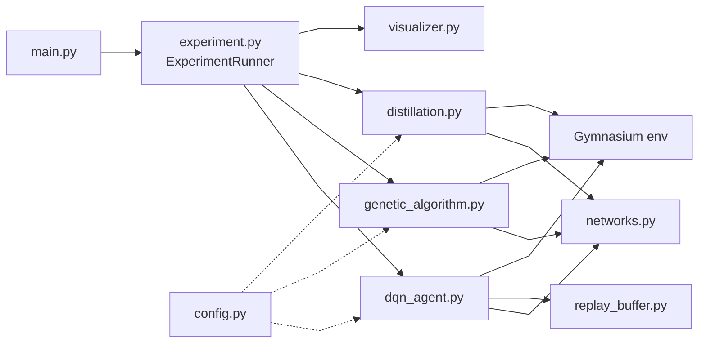
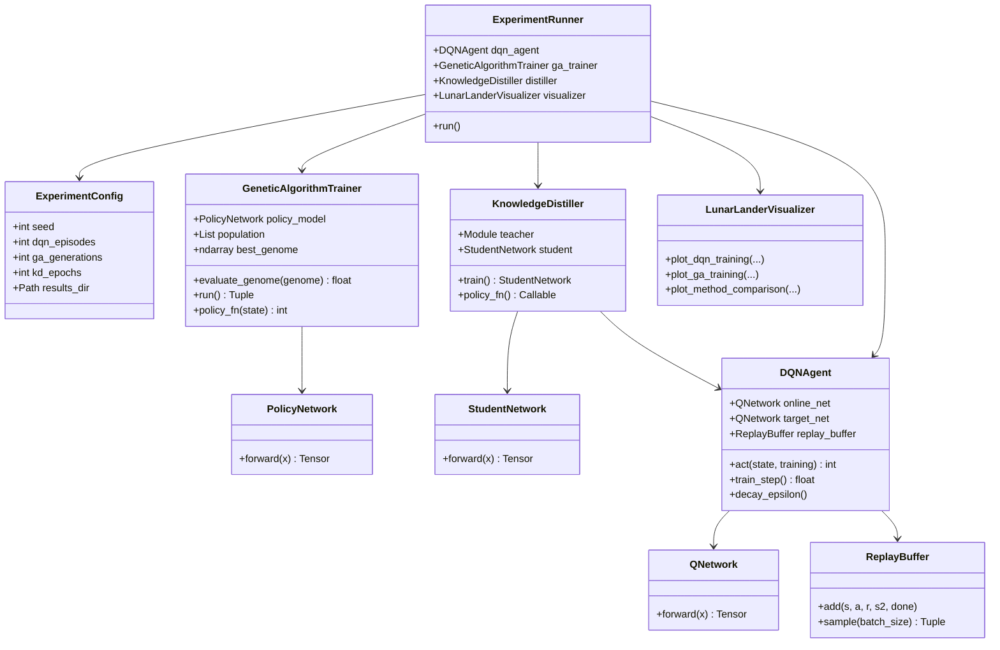
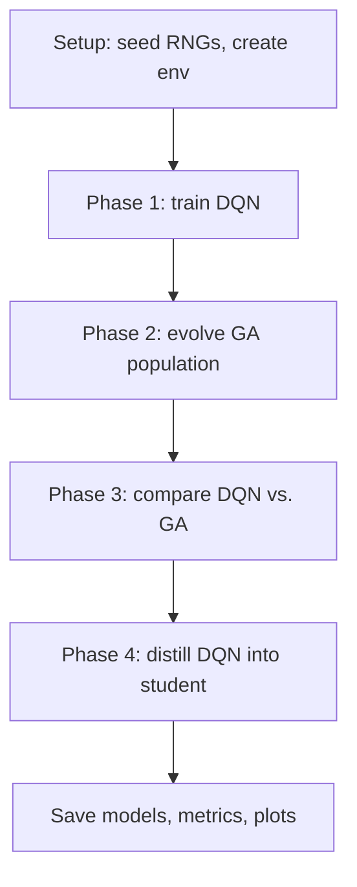
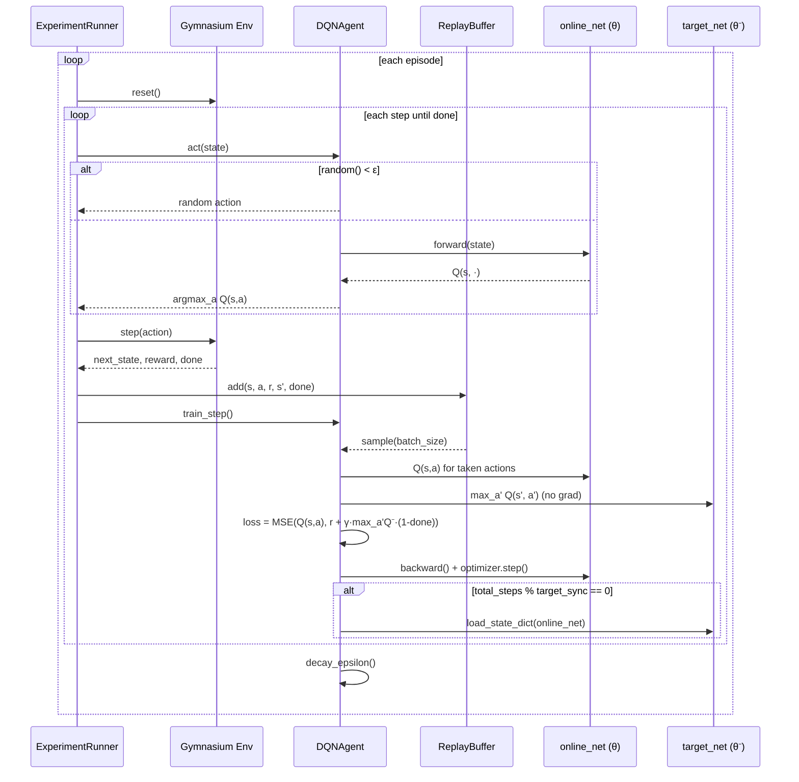
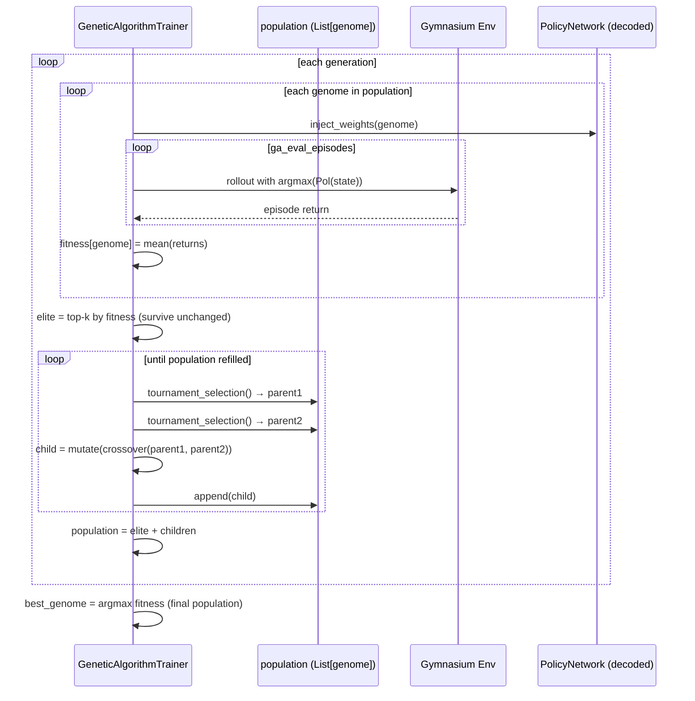
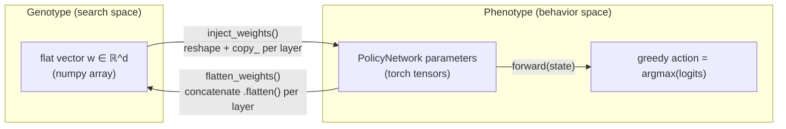
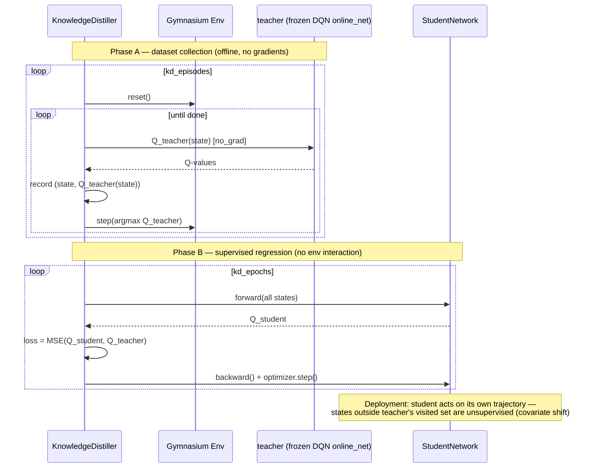

# DQN vs. Neuroevolution vs. Knowledge Distillation on LunarLander-v3

A comparative study of three approaches to solving the `LunarLander-v3`
control task (Gymnasium):

- **Deep Q-Network (DQN)** — value-based temporal-difference learning with
  experience replay and a target network.
- **Neuroevolution (Genetic Algorithm)** — direct policy search over a flat
  weight vector, using elitism, tournament selection, uniform crossover, and
  Gaussian mutation.
- **Knowledge distillation** — a compact student network trained offline to
  match the DQN teacher's Q-values.

## Table of contents

- [Problem setup](#problem-setup)
- [Theory](#theory)
  - [1. The MDP and the control problem](#1-the-mdp-and-the-control-problem)
  - [2. Deep Q-Network (value-based RL)](#2-deep-q-network-value-based-rl)
  - [3. Neuroevolution (direct policy search)](#3-neuroevolution-direct-policy-search)
  - [4. Knowledge distillation](#4-knowledge-distillation)
  - [5. Why the three methods diverge](#5-why-the-three-methods-diverge)
- [Architecture](#architecture)
  - [Module/package diagram](#modulepackage-diagram)
  - [Class diagram (UML)](#class-diagram-uml)
  - [Experiment pipeline (flowchart)](#experiment-pipeline-flowchart)
  - [DQN training step (sequence diagram)](#dqn-training-step-sequence-diagram)
  - [GA generation (sequence diagram)](#ga-generation-sequence-diagram)
  - [Genome encode/decode (state diagram)](#genome-encodedecode-state-diagram)
  - [Knowledge distillation (sequence diagram)](#knowledge-distillation-sequence-diagram)
- [Results](#results)
- [Files](#files)
- [Setup](#setup)
- [Running](#running)
- [References](#references)

## Problem setup

`LunarLander-v3` is an 8-dimensional continuous-state, 4-action discrete
control task: land a rigid body between two flags using a main engine and
two lateral thrusters, under gravity and fuel cost, without crashing or
drifting out of bounds.

| Symbol | Meaning |
|---|---|
| $s = (x, y, v_x, v_y, \theta, \omega, \text{leg}_1, \text{leg}_2)$ | position, velocity, angle, angular velocity, leg-contact flags |
| $a \in \{\text{noop}, \text{left engine}, \text{main engine}, \text{right engine}\}$ | discrete action |
| $r(s,a,s')$ | shaped reward: distance/velocity/angle penalties, leg-contact bonus, fuel cost, ±100 for crash/landing |
| solved threshold | mean return ≥ 200 over 100 episodes |

All three methods are compared on the **same environment, same reward
function, same evaluation protocol** (Monte-Carlo return over held-out
episodes) — only the *learning algorithm* and *policy representation*
change.

## Theory

### 1. The MDP and the control problem

The task is a Markov Decision Process $(\mathcal{S}, \mathcal{A}, P, r, \gamma)$.
A policy $\pi$ selects actions to maximize the expected discounted return:

$$
J(\pi) = \mathbb{E}_{\tau \sim \pi}\left[\sum_{t=0}^{T} \gamma^t r_t\right]
$$

There are two broad families of solution methods, both implemented here:

- **Value-based** (DQN): learn $Q^\pi(s,a)$, the expected return of taking
  $a$ in $s$ and then following $\pi$; derive a policy via
  $\pi(s) = \arg\max_a Q(s,a)$.
- **Direct policy search** (GA / neuroevolution): parameterize a policy
  $\pi_\theta$ directly and search $\theta$-space using a black-box,
  gradient-free optimizer, guided only by episodic return.

### 2. Deep Q-Network (value-based RL)

DQN (Mnih et al., 2015) approximates the optimal action-value function
$Q^*(s,a)$ with a neural network $Q_\theta$, trained by minimizing the
**Bellman residual** on transitions sampled from a replay buffer:

$$
\mathcal{L}(\theta) = \mathbb{E}_{(s,a,r,s') \sim \mathcal{D}}
\Big[\big(Q_\theta(s,a) - y\big)^2\Big], \qquad
y = r + \gamma (1 - \text{done}) \max_{a'} Q_{\theta^-}(s', a')
$$

Two stabilization tricks are used, both visible in `dqn_agent.py`:

- **Experience replay** (`replay_buffer.py`): transitions are stored in a
  buffer and sampled uniformly at random, breaking the temporal
  correlation between consecutive $(s,a,r,s')$ tuples that would otherwise
  make SGD updates highly correlated and unstable.
- **Target network** $\theta^-$: a periodically-synced copy of $\theta$
  used only to compute the bootstrap target $y$. Without it, $\theta$
  chases a target that moves every step (its own prediction), which is a
  classic source of divergence in bootstrapped, function-approximated TD
  learning ("the deadly triad": bootstrapping + function approximation +
  off-policy data).

Exploration uses **ε-greedy**: with probability $\varepsilon$ take a random
action, otherwise $\arg\max_a Q_\theta(s,a)$; $\varepsilon$ decays
geometrically from `dqn_epsilon_start` to `dqn_epsilon_min`
(`config.py`), trading exploration for exploitation as $Q_\theta$ improves.

### 3. Neuroevolution (direct policy search)

The GA (`genetic_algorithm.py`) treats the policy network's entire weight
vector as a **genotype** $w \in \mathbb{R}^d$ (flattened via
`flatten_weights`/`inject_weights` — a direct encoding, following the
spirit of Stanley & Miikkulainen's NEAT lineage, minus topology evolution).
There is no gradient anywhere in this loop; fitness is the **Monte-Carlo
episodic return** of the decoded policy, a black-box, non-differentiable
signal.

One generation applies:

1. **Fitness evaluation** — roll out every genome's decoded policy for
   `ga_eval_episodes` episode(s); fitness = mean return.
2. **Elitism** — the top `ga_n_elite` genomes survive unchanged, guaranteeing
   monotonic improvement of the population's best fitness.
3. **Tournament selection** — sample `k=5` genomes uniformly, keep the
   fittest as a parent; repeated to fill the mating pool.
4. **Uniform crossover** — child gene $i$ is copied from parent 1 or parent
   2 with probability 0.5 each, independently per gene.
5. **Gaussian mutation** — $w' = w + \sigma \epsilon,\ \epsilon \sim
   \mathcal{N}(0, I)$, injecting variance the crossover step alone cannot
   produce.

This is a genuinely different search paradigm from DQN: it never computes
$\partial \mathcal{L}/\partial \theta$, needs no differentiable reward,
and evolves an entire *population* of candidate policies rather than one.
Its cost is sample efficiency — Monte-Carlo fitness is a very high-variance,
low-information signal per environment interaction compared to per-step TD
updates.

### 4. Knowledge distillation

`distillation.py` implements offline distillation (Hinton et al., 2015):
a small `StudentNetwork` is trained to regress the *teacher's Q-values*
directly, rather than being trained by interacting with the environment:

$$
\mathcal{L}_{\text{KD}} = \mathbb{E}_{s \sim \mathcal{D}_{\text{teacher}}}
\big[\, \lVert Q_{\text{student}}(s) - Q_{\text{teacher}}(s) \rVert_2^2 \,\big]
$$

The dataset $\mathcal{D}_{\text{teacher}}$ is collected by rolling the
**frozen, greedy teacher policy** for `kd_episodes` episodes and recording
its full Q-value vector at every visited state (`_collect_dataset`). The
student then does pure supervised regression (no environment interaction)
for `kd_epochs`.

The critical caveat, and the reason distillation collapses in the results
below: the student is only ever supervised on states the *teacher* visits.
Once deployed, the student's own (imperfect) actions push it into states
slightly outside that support — the teacher never demonstrated the correct
Q-values there, small errors compound step after step, and the trajectory
diverges from anything in the training distribution. This is the classic
**covariate shift / compounding error** problem of offline behavioral
cloning (closely related to why plain behavioral cloning underperforms
interactive imitation learning like DAgger).

### 5. Why the three methods diverge

| | DQN | GA (neuroevolution) | Distilled student |
|---|---|---|---|
| Learning signal | per-step TD error (dense) | episodic return (sparse, Monte-Carlo) | supervised regression to teacher Q-values (dense, but offline) |
| Uses gradients? | yes (backprop through $Q_\theta$) | no (population search) | yes (backprop through student) |
| Interacts with env during training? | yes, on-policy-ish via replay | yes, every genome every generation | no — trained purely offline on teacher rollouts |
| Main failure mode | can diverge without replay/target net | high variance, slow convergence under sparse fitness | covariate shift at deployment time |

## Architecture

### Module/package diagram



`config.py` supplies shared hyperparameters/seeding to the DQN, GA, and
distillation modules (dashed edges); `evaluation.py` is used by all three
for Monte-Carlo rollouts and is omitted here for clarity.

### Class diagram (UML)



`ExperimentRunner` owns one instance of each component and wires the DQN's
trained `online_net` in as the `teacher` for `KnowledgeDistiller`. All
four trainer/agent classes also read from `ExperimentConfig` (omitted
above to keep the diagram readable).

### Experiment pipeline (flowchart)



Each phase also evaluates and plots its own policy (mean return, success
rate, trajectory) immediately after training, before moving to the next
phase.

### DQN training step (sequence diagram)



### GA generation (sequence diagram)



### Genome encode/decode (state diagram)



### Knowledge distillation (sequence diagram)



## Results

| Policy | Mean return (100 eval episodes) | Success rate |
|---|---|---|
| DQN | 233.11 | 78.0% |
| GA (neuroevolution) | -18.38 | 23.0% |
| Distilled student | -240.24 | 0% |

DQN converges to a strong, reliable landing policy. The GA policy is far
less sample-efficient under a sparse, Monte-Carlo fitness signal and shows
much higher variance. The distilled student collapses due to covariate
shift / compounding errors typical of offline imitation from a teacher's
on-policy state distribution.

Training curves, trajectories, and the distillation loss are in
`results/lunar_lander/`.

## Files

- `main.py` — entry point; runs the full experiment end to end.
- `lunar_lander/` — package with the implementation: `config.py`
  (hyperparameters), `networks.py` (Q/policy/student networks),
  `replay_buffer.py`, `dqn_agent.py`, `genetic_algorithm.py` (genome codec,
  genetic operators, GA trainer), `distillation.py`, `evaluation.py`
  (rollout/eval helpers), `visualizer.py`, and `experiment.py` (orchestrates
  the four phases).
- `results/lunar_lander/` — output plots (training curves, DQN vs. GA
  comparison, trajectories, action distributions, distillation loss).

## Setup

```bash
python -m venv .venv
.venv\Scripts\activate   # or: source .venv/bin/activate
pip install -r requirements.txt
```

## Running

```bash
python main.py
```

Trained weights and evaluation histories (`*.pth`, `*.npy`) are not
tracked in this repo — running the script regenerates them locally under
`results/lunar_lander/`.

## References

- Sutton & Barto (2018). *Reinforcement Learning: An Introduction.* MIT Press.
- Mnih et al. (2015). *Human-level control through deep reinforcement learning.* Nature.
- Stanley & Miikkulainen (2002). *Evolving Neural Networks through Augmenting Topologies.*
- Hinton et al. (2015). *Distilling the Knowledge in a Neural Network.*
